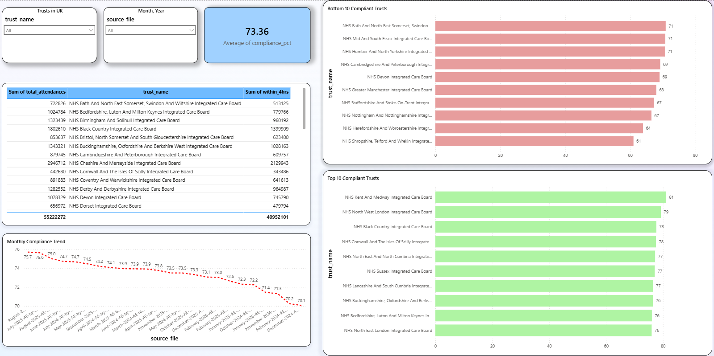

# NHS A&E Performance Review Analysis

Analysis of NHS England A&E 4-hour waiting time compliance across hospital trusts (2024-2026).

## Plan
- Downloaded 2 years of public NHS A&E records (>100,000 records).
- Cleaned and structured the data utilising Python and SQL.
- Identified that all trusts across the UK are below the 95% compliance target across 2 years.
- Built an interactive dashboard using Microsoft Power BI to visualise the data analysis.

## Skills used in this project 
Python 
SQL 
Microsoft Power BI 
Microsoft Excel 
VS Code 

## Notable Findings 
-	Lowest compliance was at 61% (NHS Shropshire, Telford and Wrekin)
-	All trusts fall below 95% compliance in 2024-2026
-	Highest average monthly compliance was in August 2024 at 75.7%, followed by July 2025 at 75.6%.
-	In the past 2 years, the highest average compliance was 81.2% at NHS Kent and Medway, being the only ones to break into > 80% thresholds after having seen > 2.28 million patients
-	Monthly compliance trends show warmer months, May - August, have an increase in average compliance, scoring equal to or above 75% when rounding.   

